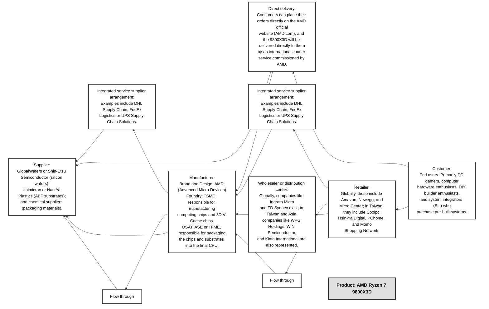

```mermaid
flowchart RL
    %% 產品名稱標籤
    Product["Product: AMD Ryzen 7 9800X3D"]:::titleBox

    %% 將主要節點包裝在水平子圖中
    subgraph MainFlow [ ]
        direction RL
        C["Customer:<br>End users. Primarily PC gamers, computer<br>hardware enthusiasts, DIY builder enthusiasts,<br>and system integrators (SIs) who<br>purchase pre-built systems."]
        
        R["Retailer:<br>Globally, these include Amazon, Newegg, and<br>Micro Center; in Taiwan, they include Coolpc,<br>Hsin-Ya Digital, PChome, and Momo<br>Shopping Network."]
        
        W["Wholesaler or distribution center:<br>Globally, companies like Ingram Micro<br>and TD Synnex exist; in Taiwan and Asia,<br>companies like WPG Holdings, WIN Semiconductor,<br>and Kinta International are also represented."]
        
        M["Manufacturer:<br>Brand and Design: AMD (Advanced Micro Devices)<br>Foundry: TSMC, responsible for manufacturing<br>computing chips and 3D V-Cache chips.<br>OSAT: ASE or TFME, responsible for packaging<br>the chips and substrates into the final CPU."]
        
        S["Supplier:<br>GlobalWafers or Shin-Etsu Semiconductor (silicon wafers);<br>Unimicron or Nan Ya Plastics (ABF substrates);<br>and chemical suppliers (packaging materials)."]

        %% 主水平線箭頭 (已移除 Industrial distribution)
        C --> R
        R --> W
        W --> M
        M --> S
    end

    %% 右上方流程 (對應 Retailer 與 Manufacturer 之間)
    FT2["Flow through"]
    ISSA2["Integrated service supplier arrangement:<br>Examples include DHL Supply Chain, FedEx<br>Logistics or UPS Supply Chain Solutions."]

    R --> FT2
    R --> ISSA2
    FT2 --> M
    ISSA2 --> M

    %% 左上方流程 (對應 Manufacturer 與 Supplier 之間)
    FT1["Flow through"]
    ISSA1["Integrated service supplier arrangement:<br>Examples include DHL Supply Chain, FedEx<br>Logistics or UPS Supply Chain Solutions."]

    M --> FT1
    M --> ISSA1
    FT1 --> S
    ISSA1 --> S

    %% 下方直達流程
    DD["Direct delivery:<br>Consumers can place their orders directly on the AMD official<br>website (AMD.com), and the 9800X3D will be delivered directly to them<br>by an international courier service commissioned by AMD."]

    C --> DD
    DD --> M
    DD --> S

    %% 利用隱藏線條將產品名稱固定在圖表正上方
    Product ~~~ FT1
    Product ~~~ FT2

    %% 樣式設定
    classDef default fill:#ffffff,stroke:#333333,stroke-width:2px,color:#000000;
    classDef titleBox fill:#e0e0e0,stroke:#333333,stroke-width:3px,font-weight:bold,font-size:18px;
    style MainFlow fill:none,stroke:none;
```
