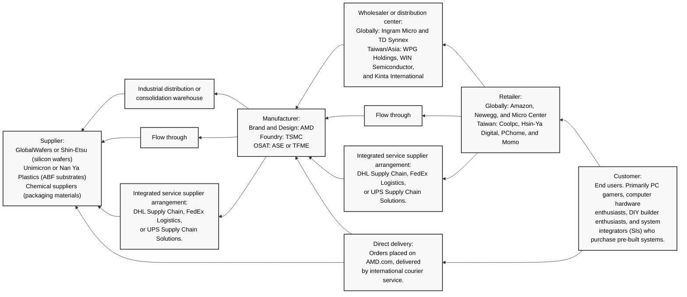

```mermaid
graph RL
    %% 定義節點與填入資訊
    Customer["Customer:<br>End users. Primarily PC gamers, computer hardware<br>enthusiasts, DIY builder enthusiasts, and system<br>integrators (SIs) who purchase pre-built systems."]
    
    Retailer["Retailer:<br>Globally: Amazon, Newegg, and Micro Center<br>Taiwan: Coolpc, Hsin-Ya Digital, PChome, and Momo"]
    
    Wholesaler["Wholesaler or distribution center:<br>Globally: Ingram Micro and TD Synnex<br>Taiwan/Asia: WPG Holdings, WIN Semiconductor,<br>and Kinta International"]
    
    Manufacturer["Manufacturer:<br>Brand and Design: AMD<br>Foundry: TSMC<br>OSAT: ASE or TFME"]
    
    IndDist["Industrial distribution or<br>consolidation warehouse"]
    
    Supplier["Supplier:<br>GlobalWafers or Shin-Etsu (silicon wafers)<br>Unimicron or Nan Ya Plastics (ABF substrates)<br>Chemical suppliers (packaging materials)"]

    %% 主幹流程 (箭頭向左)
    Customer --> Retailer
    Retailer --> Wholesaler
    Wholesaler --> Manufacturer
    Manufacturer --> IndDist
    IndDist --> Supplier

    %% 下方 Direct delivery 流程
    DirectDelivery["Direct delivery:<br>Orders placed on AMD.com, delivered<br>by international courier service."]
    
    Customer -->| | DirectDelivery
    DirectDelivery -->| | Manufacturer
    DirectDelivery -->| | Supplier

    %% 右上方流程
    FlowThroughRight["Flow through"]
    IntegratedRight["Integrated service supplier arrangement:<br>DHL Supply Chain, FedEx Logistics,<br>or UPS Supply Chain Solutions."]
    
    Retailer -->| | FlowThroughRight
    Retailer -->| | IntegratedRight
    FlowThroughRight -->| | Manufacturer
    IntegratedRight -->| | Manufacturer

    %% 左上方流程
    FlowThroughLeft["Flow through"]
    IntegratedLeft["Integrated service supplier arrangement:<br>DHL Supply Chain, FedEx Logistics,<br>or UPS Supply Chain Solutions."]
    
    Manufacturer -->| | FlowThroughLeft
    Manufacturer -->| | IntegratedLeft
    FlowThroughLeft -->| | Supplier
    IntegratedLeft -->| | Supplier

    %% 排版樣式微調
    classDef default fill:#f9f9f9,stroke:#333,stroke-width:2px,color:#000;
```
