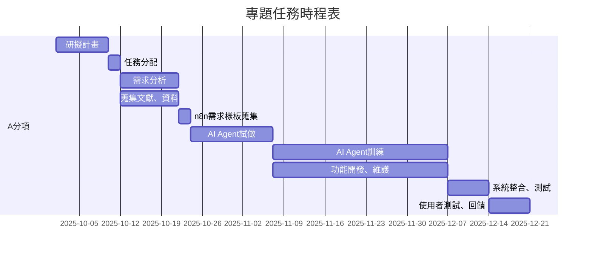
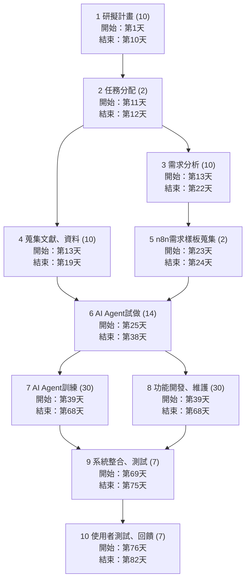

# Group HomeWork_2

| 學號 | 姓名 | 分工 |
| :---: | :---: | :---: |
| C112118142 | 游益哲 | 需求分析、GitHub撰寫 |
| C112118139 | 林丙弘 | 文獻探討、系統維護 |
| C112118148 | 郭建佑 | 數據庫收集 |
| C112118129 | 張詠竣 | AI Agent建置 |

82天

專題甘特圖：

PERT/CPM圖：

