# ✨ Group HomeWork_2 專題文件總覽

---

## 👨‍💻 團隊成員與分工

>專題時程：2025/10/01 ～ 2025/12/21

| 學號 | 姓名 | 分工 |
| :---: | :---: | :---: |
| C112118142 | 游益哲 | **需求分析**、GitHub文件撰寫 |
| C112118139 | 林丙弘 | **文獻探討**、系統維護 |
| C112118148 | 郭建佑 | **數據庫收集**、GitHub文件修正維護 |
| C112118129 | 張詠竣 | **AI Agent建置** |

---
## 📅 任務時程

| 任務編號 | 任務名稱 | 持續天數 | 開始日期 | 結束日期 | 前置任務 |
| :---: | :--- | :---: | :---: | :---: | :---: |
| 1 | 研擬計畫 | 10 | 2025/10/01 | 2025/10/10 | — |
| 2 | 任務分配 | 2 | 2025/10/11 | 2025/10/12 | 1 |
| 3 | 需求分析 | 10 | 2025/10/13 | 2025/10/22 | 2 |
| 4 | 蒐集文獻、資料 | 10 | 2025/10/13 | 2025/10/22 | 2 |
| 5 | n8n需求樣板蒐集 | 2 | 2025/10/23 | 2025/10/24 | 3 |
| 6 | AI Agent試做 | 14 | 2025/10/25 | 2025/11/07 | 4, 5 |
| 7 | AI Agent訓練 | 25 | 2025/11/08 | 2025/12/02 | 6 |
| 8 | 功能開發、維護 | 30 | 2025/11/08 | 2025/12/07 | 6 |
| 9 | 系統整合、測試 | 7 | 2025/12/08 | 2025/12/14 | 7, 8 |
| 10 | 使用者測試、回饋 | 7 | 2025/12/15 | 2025/12/21 | 9 |
---
## 📊 甘特圖與PERT/CPM圖

```mermaid
gantt
dateFormat  YYYY-MM-DD
title 專題任務時程表
excludes weekdays 

研擬計畫   :         des1, 2025-10-01,2025-10-10
任務分配    :         des2, after des1, 2d
需求分析    :         des3, after des2, 10d
蒐集文獻、資料    :         des4, after des2, 10d
n8n需求樣板蒐集    :         des5, after des3, 2d
AI Agent試做    :         des6, after des4 des5, 14d
AI Agent訓練   :      des7, after des6, 25d
功能開發、維護    :         des8, after des6, 30d
系統整合、測試    :         des9, after des7 des8, 7d
使用者測試、回饋    :       des10, after des9, 7d
```

```mermaid
graph TD
    T1["1 研擬計畫 (10天)
      開始：第1天
      結束：第10天"] --> T2["2 任務分配 (2天)
      開始：第11天
      結束：第12天"]
    T2 --> T3["3 需求分析 (10天)
              開始：第13天
              結束：第22天"]

    T2 --> T4["4 蒐集文獻、資料 (10天)
              開始：第13天
              結束：第22天"]

    T3 --> T5["5 n8n需求樣板蒐集 (2天)
              開始：第23天
              結束：第24天"]

    T4 --> T6["6 AI Agent試做 (14天)
              開始：第25天
              結束：第38天"]
    T5 --> T6

    T6 --> T7["7 AI Agent訓練 (25天)
              開始：第39天
              結束：第63天"]
    T6 --> T8["8 功能開發、維護 (30天)
              開始：第39天
              結束：第68天"]

    T7 --> T9["9 系統整合、測試 (7天)
              開始：第69天
              結束：第75天"]
    T8 --> T9

    T9 --> T10["10 使用者測試、回饋 (7天)
                開始：第76天
                結束：第82天"]
    
    classDef crit fill:#c8f7e3,stroke:#2c8,stroke-width:2px;
    class T1,T2,T3,T5,T6,T8,T9,T10 crit;
    
```

>關鍵路徑：1 --> 2 --> 3 --> 5 --> 6 --> 8 --> 9 --> 10
