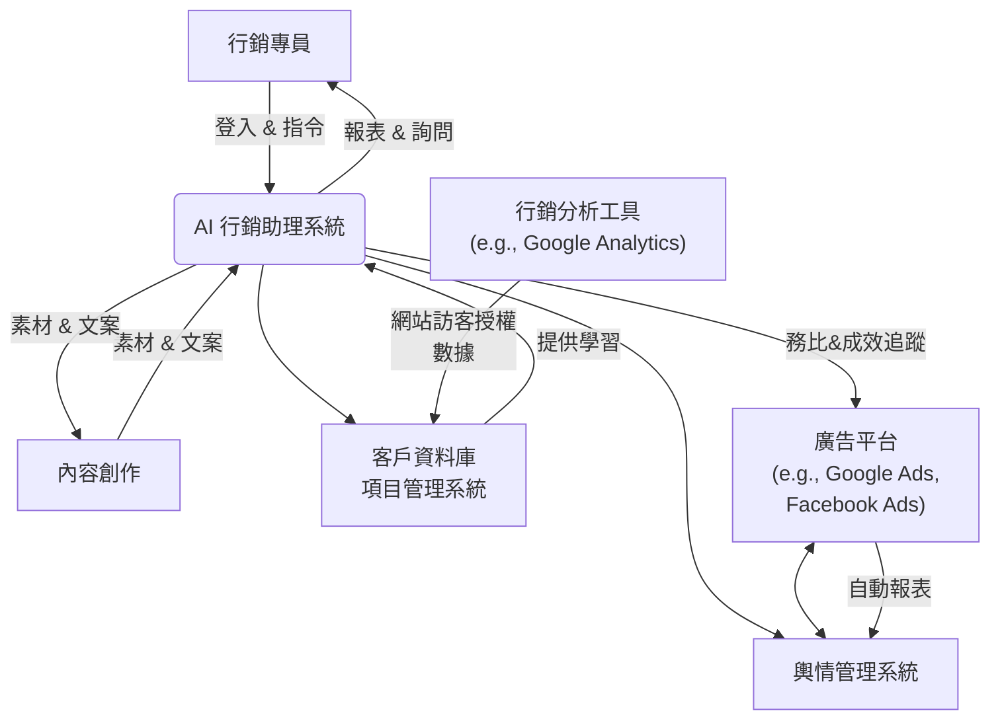

# Group HomeWork_4

## 一、系統環境圖

```mermaid
graph TD
    %% 定義節點 (方塊)
    A[行銷專員]
    B[內容創作]
    C(AI 行銷助理系統)
    D["客戶資料庫 <br> 項目管理系統"]
    E[輿情管理系統]
    F["行銷分析工具 <br> (e.g., Google Analytics)"]
    G["廣告平台 <br> (e.g., Google Ads, <br/> Facebook Ads)"]

    %% 定義連結 (箭頭)
    A -- "登入 & 指令" --> C
    C -- "報表 & 詢問" --> A

    B -- "素材 & 文案" --> C
    C -- "素材 & 文案" --> B

    C -- "務比&成效追蹤" --> G
    C --> E
    C --> D

    G <--> E
    G -- "自動報表" --> E

    F -- "網站訪客授權 <br> 數據" --> D
    D -- "提供學習" --> C
```

## 二、DFD Level 0
