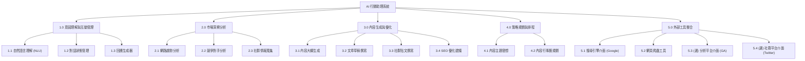
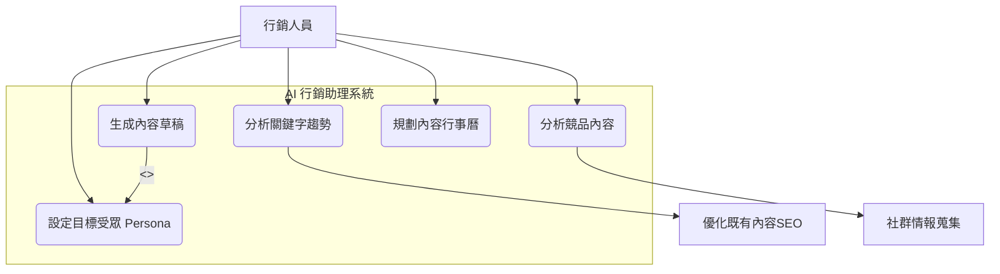

# Group HomeWork_3
---

## 一、功能性需求 (Functional Requirements)
| 模組 | 需求編號 | 描述 |
| :---- | :---- | :---- |
| 使用者互動 | FR-1-1 | 使系統能接收並理解行銷人員的自然語言指令（Ex.「幫我分析某網 A 最近的 SEO 策略」） |
|  | FR-1-2 | 系統必須能在任務執行中，主動向使用者釐清需求（Ex.「您說的『某網A』是指哪個網站？」） |
|  | FR-1-3 | 系統必須以結構化（Ex. 報告、列表）或以對話的方式清楚呈現最終結果。 |
| 市場洞察 | FR-2-1 | 系統須能夠使用搜尋引擎工具（Ex. Google Search API）來查詢特定關鍵字的市場、網路趨勢。 |
|  | FR-2-2 | 系統須能夠爬取並分析某競爭對手網站的內容（Ex. 部落格發文頻率、主題分佈）。 |
|  | FR-2-3 | 系統須能夠總結特定主題的社群媒體討論熱度（Ex. 使用 Twitter API 或相關工具）。 |
| 內容生成 | FR-3-1 | 系統須能根據指定的主題、關鍵字和目標受眾 (Persona) 生成內容大綱。 |
|  | FR-3-2 | 系統須能根據大綱，撰寫多種形式的內容草稿（Ex. 部落格文章、社群媒體貼文）。 |
|  | FR-3-3 | 系統須能對既有文案進行 SEO 優化 (Ex. 建議關鍵字佈局或修改標題)。 |
| 策略規劃 | FR-4-1 | 系統須能根據行銷目標（Ex. 提升品牌知名度）和市場洞察，建議可行的內容主題。 |
|  | FR-4-2 | 系統必須能生成一份包含主題、發布通路、建議日期的內容行事曆草案。 |
| 工具整合 | FR-5-1 | 系統須能與 Google Search API 連接整合以獲取即時搜尋結果。 |
|  | FR-5-2 | 系統須內建或連接網頁爬蟲工具，用於分析公開網頁內容。 |
|  | FR-5-3 | 系統應能連接至 Google Analytics / Search Console API，以獲取網站的實際表現數據。 |

---
## 二、非功能性需求 (Non-Functional Requirements)
| 模組 | 需求編號 | 描述 |
| :---- | :---- | :---- |
| 效能 | nFR-1-1 | 對於簡單的查詢（Ex. 生成標題），系統應能迅速回應。 |
|  | nFR-1-2 | 對於複雜的分析任務（Ex. 分析 3 個指定網站），系統應在給定時間內提供初步結果或進度更新。 |
| 可用性 | nFR-2-1 | 系統介面應為直覺的對話式介面 (ChatUI)。 |
|  | nFR-2-2 | 系統生成的報告與文案應具備高度可讀性，並允許使用者一鍵複製或匯出。 |
| 可靠性 | nFR-3-1 | 系統應能 7/24 運作，且核心服務應具備高度可用性。 |
|  | nFR-3-2 | 當外部 API（Ex. Google Search）呼叫失敗時，系統應能妥善處理錯誤，並向使用者說明錯誤情況及提供解決方法，而非直接崩潰。 |
| 安全性 | nFR-4-1 | 所有與外部 API 的連接（Ex. Google Analytics）須使用 OAuth 2.0 或 API Key 等安全驗證方式。 |
|  | nFR-4-2 | 使用者輸入的行銷策略與內部數據（若有）應被視為機密資訊，不得外洩或用於訓練公開模型。 |
| 準確性 | nFR-5-1 | 系統在進行數據分析（Ex. 競品發文頻率）時，應具備高度數據準確率。 |
|  | nFR-5-2 | 系統生成的內容草稿應為正確事實（Factually Correct），不得捏造數據或資訊。 |
| 可維護性 | nFR-6-1 | 系統應能輕易插拔 (Plug-in) 、加入新的工具（例如：未來增加 Facebook API）。 |

---
## 三、功能分解圖 (Functional Decomposition Diagram, FDD)

---
## 四、使用案例圖

---
## 五、使用案例說明

### UC1 》》分析關鍵字趨勢
| 欄位 | 內容 |
| :---- | :---- |
| 使用案例編號 | UC1 |
| 功能編號 | FR-1-1, FR-1-3, FR-2-1, FR-5-1 |
| 前置條件 | 1. 使用者已成功登入 AI 助理系統。 
2. 系統已正確配置並介接「搜尋引擎工具」(如 Google Search API)。 |
| 後置條件 | 1. 系統生成一份關於指定關鍵字的趨勢分析報告。 
2. 查詢日誌被記錄。 |
| 基本流程 | 1. 使用者輸入指令：「幫我查詢『AI Agent』和『RAG』這兩個關鍵字最近的搜尋趨勢。」(FR-1-1)。 
2. 系統解析指令，識別出關鍵字和分析任務。 
3. 系統調用「搜尋引擎工具」(FR-5-1)，查詢指定關鍵字的搜尋熱度、相關查詢、以及地理分佈 (F-004)。 
4. 系統匯總 API 回傳的數據。 
5. 系統以結構化圖表或摘要列表的形式，回報分析結果 (FR-2-1)。 |

### UC2 》》分析競品內容
| 欄位 | 內容 |
| :---- | :---- |
| 使用案例編號 | UC2 |
| 功能編號 | FR-1-1, FR-1-3, FR-2-2, FR-5-2 |
| 前置條件 | 1. 使用者已成功登入 AI 助理系統。 
2. 系統已整合「網頁爬蟲工具」(FR-5-2)。 |
| 後置條件 | 1. 系統生成一份結構化的競品分析報告並呈現給使用者。 
2. 此分析任務的指令與產出結果被記錄。 |
| 基本流程 | 1. 使用者輸入指令：「幫我分析 [競品A網站] 和 [競品B網站] 最近一個月的部落格主題和發文頻率。」(FR-1-1)。 
2. 系統解析指令，識別任務為「競品分析」，並解析出目標 URL 和時間範圍。 
3. 系統啟動「網頁爬蟲工具」(FR-5-2)，爬取目標網站的公開內容（如部落格列表）。 
4. 系統依時間範圍過濾文章，並對內容進行 NLP 主題分類與頻率計算 (FR-2-2)。 
5. 系統匯總分析結果，生成包含「發文 fréquence」、「主要主題分佈」、「熱門文章標題」的摘要報告。 
6. 系統將此報告呈現給行銷人員 (FR-1-3)。 |

### UC3 》》生成內容草稿
| 欄位 | 內容 |
| :---- | :---- |
| 使用案例編號 | UC3 |
| 功能編號 | FR-1-1, FR-1-2, FR-1-3, FR-2-1, FR-3-1, FR-3-2, FR-5-1 |
| 前置條件 | 1. 使用者已成功登入 AI 助理系統。 2. 系統已整合 Google Search API (FR-5-1)。 3. (建議) 已定義至少一組目標受眾 (Persona)。 |
| 後置條件 | 1. 系統生成一份符合要求的內容草稿（如部落格文章）。 
2. 使用者可對此草稿進行後續的編輯或匯出。 |
| 基本流程 | 1. 使用者輸入指令，包含主題、風格和目標受眾（例如：「幫我寫一篇關於『AI Agent 在行銷的 5 個應用』的部落格文章，風格要專業但易懂，目標受眾是中小型企業主」） (FR-1-1)。 
2. 系統解析任務，並判斷需要外部資訊以確保內容的即時性。 
3. 系統啟動「搜尋引擎工具」(FR-5-1)，研究「AI Agent marketing applications」相關資料 (FR-2-1)。 
4. 系統根據研究結果和使用者指定的 Persona，生成一份「內容大綱」 (FR-3-1)。 
5. 系統向使用者呈現大綱，並請求確認 (FR-1-2)。 
6. 使用者回覆：「大綱沒問題，請繼續。」 
7. 系統根據核可的大綱與 Persona 設定，撰寫完整的文章草稿 (FR-3-2)。 
8. 系統將完整的草稿呈現給行銷人員 (FR-1-3)。 |

### UC4 》》規劃內容行事曆
| 欄位 | 內容 |
| :---- | :---- |
| 使用案例編號 | UC4 |
| 功能編號 | FR-1-1, FR-1-3, FR-2-1, FR-4-1, FR-4-2 |
| 前置條件 | 1. 使用者已成功登入系統。 
2. 使用者已告知 AI 助理其主要的行銷目標或核心主題。 |
| 後置條件 | 1. 系統生成一份包含日期、主題、通路建議的內容行事曆草案 (FR-4-2)。 |
| 基本流程 | 1. 使用者輸入指令：「幫我規劃下個月的內容行事曆，主要推廣『SaaS 服務』，頻率一週兩篇部落格、三篇社群貼文。」(FR-1-1)。 
2. 系統解析目標、主題和頻率。 
3. 系統(可選) 執行 UC001 (分析關鍵字趨勢) (FR-2-1) 以尋找「SaaS 服務」相關的熱門子主題。 
4. 系統根據主題和趨勢，發想一系列的內容主題 (FR-4-1)。 
5. 系統將這些主題平均分配到下個月的日期中，並標記建議的通路 (FR-4-2)。 
6. 系統以表格或行事曆視圖的形式，呈現此草案 (FR-1-3)。 |

### UC5 》》設定目標受眾
| 欄位 | 內容 |
| :---- | :---- |
| 使用案例編號 | UC5 |
| 功能編號 | FR-1-1, FR-1-2, FR-1-3 |
| 前置條件 | 1. 使用者已成功登入系統。 |
| 後置條件 | 1. 系統的知識庫中成功建立或更新了一組 Persona 描述。 
2. 此 Persona 可被 UC003 (FR-3-1, FR-3-2) 等案例調用。 |
| 基本流程 | 1. 使用者輸入指令：「我想建立一個新的 Persona：『中小型企業主』。」(FR-1-1)。 
2. 系統識別任務，並開始提問以收集 Persona 細節 (FR-1-2)。 
3. 系統提問：「請描述他們的痛點、關注的價值、以及常用的資訊頻道。」 
4. 使用者回答：「痛點是成本高、缺人手。價值是 CP 值、易用性。頻道是 Facebook、Email。」 
5. 系統總結 Persona 資訊，並儲存至內部資料庫。 
6. 系統回覆：「好的，Persona『中小型企業主』已儲存。您未來在生成內容時可以指定使用。」(FR-1-3)。 |

### UC6 》》優化既有內容SEO
| 欄位 | 內容 |
| :---- | :---- |
| 使用案例編號 | UC6 |
| 功能編號 | FR-1-1, FR-1-3, FR-2-1, FR-3-3, FR-5-1 |
| 前置條件 | 1. 使用者已成功登入系統。 
2. 使用者準備好一篇既有的文章（以文字貼入或提供 URL）。|
| 後置條件 | 1. 系統提供一份針對該文章的具體 SEO 優化建議列表。 |
| 基本流程 | 1. 使用者貼上一篇文章，並輸入指令：「幫我優化這篇文章，目標關鍵字是『AI 助理』。」(FR-1-1)。 
2. 系統解析指令，鎖定目標關鍵字與文章內容。 
3. 系統(可選) 調用「搜尋引擎工具」(FR-5-1) 分析「AI 助理」目前排名靠前的文章特徵 (FR-2-1)。 
4. 系統將使用者的文章與關鍵字、競品特徵進行比對分析 (FR-3-3)。 
5. 系統生成一份具體的優化建議列表（例如：「建議標題(H1)應包含『AI 助理』」、「內文中『RAG』一詞可多加著墨」、「缺乏行動呼籲(CTA)」）。 
6. 系統將此建議列表呈現給使用者 (FR-1-3)。 |

### UC7 》》社群情報蒐集
| 欄位 | 內容 |
| :---- | :---- |
| 使用案例編號 | UC8 |
| 功能編號 | FR-1-1, FR-1-3, FR-2-3 |
| 前置條件 | 1. 使用者已成功登入系統。 
2. 系統已介接至少一個社群媒體 API (如 X/Twitter) (隱含FR-2-3)。 |
| 後置條件 | 1. 系統生成一份關於特定主題的即時社群輿情摘要報告。 |
| 基本流程 | 1. 使用者輸入指令：「幫我看看過去 24 小時，X (Twitter) 上大家對『我們新產品 Project Alpha』的看法。」(FR-1-1)。 
2. 系統解析指令，鎖定關鍵字、時間範圍與社群平台。 
3. 系統調用「社群平台介面」，蒐集包含「Project Alpha」的相關貼文 (FR-2-3)。 
4. 系統對蒐集到的貼文進行情感分析（正面/負面/中立）並提取熱門關鍵詞。 
5. 系統匯總分析結果，生成一份輿情摘要（例如：「整體情緒：65% 正面」、「熱議主題：價格太高、UI 很美」）。 
6. 系統將此摘要報告呈現給使用者 (FR-1-3)。 |
