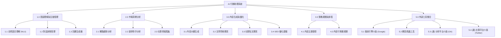
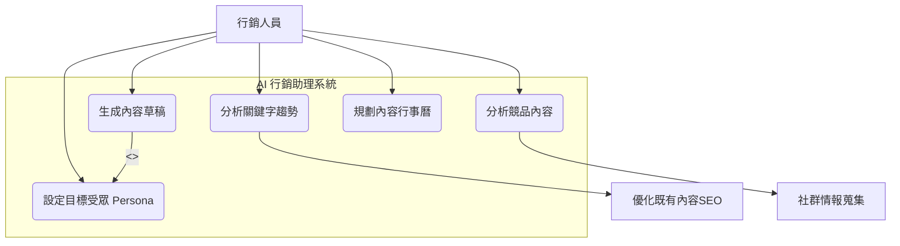

# Group HomeWork_3
---

## 一、功能性需求 (Functional Requirements)
| 模組 | 需求編號 | 描述 |
| :---- | :---- | :---- |
| 使用者互動 | FR-1-1 | 使系統能接收並理解行銷人員的自然語言指令（Ex.「幫我分析某網 A 最近的 SEO 策略」） |
|  | FR-1-2 | 系統必須能在任務執行中，主動向使用者釐清需求（Ex.「您說的『某網A』是指哪個網站？」） |
|  | FR-1-3 | 系統必須以結構化（Ex. 報告、列表）或以對話的方式清楚呈現最終結果。 |
| 市場洞察 | FR-2-1 | 系統須能夠使用搜尋引擎工具（Ex. Google Search API）來查詢特定關鍵字的市場、網路趨勢。 |
|  | FR-2-2 | 系統須能夠爬取並分析某競爭對手網站的內容（Ex. 部落格發文頻率、主題分佈）。 |
|  | FR-2-3 | 系統須能夠總結特定主題的社群媒體討論熱度（Ex. 使用 Twitter API 或相關工具）。 |
| 內容生成 | FR-3-1 | 系統須能根據指定的主題、關鍵字和目標受眾 (Persona) 生成內容大綱。 |
|  | FR-3-2 | 系統須能根據大綱，撰寫多種形式的內容草稿（Ex. 部落格文章、社群媒體貼文）。 |
|  | FR-3-3 | 系統須能對既有文案進行 SEO 優化 (Ex. 建議關鍵字佈局或修改標題)。 |
| 策略規劃 | FR-4-1 | 系統須能根據行銷目標（Ex. 提升品牌知名度）和市場洞察，建議可行的內容主題。 |
|  | FR-4-2 | 系統必須能生成一份包含主題、發布通路、建議日期的內容行事曆草案。 |
| 工具整合 | FR-5-1 | 系統須能與 Google Search API 連接整合以獲取即時搜尋結果。 |
|  | FR-5-2 | 系統須內建或連接網頁爬蟲工具，用於分析公開網頁內容。 |
|  | FR-5-3 | 系統應能連接至 Google Analytics / Search Console API，以獲取網站的實際表現數據。 |

---
## 二、非功能性需求 (Non-Functional Requirements)
| 模組 | 需求編號 | 描述 |
| :---- | :---- | :---- |
| 效能 | nFR-1-1 | 對於簡單的查詢（Ex. 生成標題），系統應能迅速回應。 |
|  | nFR-1-2 | 對於複雜的分析任務（Ex. 分析 3 個指定網站），系統應在給定時間內提供初步結果或進度更新。 |
| 可用性 | nFR-2-1 | 系統介面應為直覺的對話式介面 (ChatUI)。 |
|  | nFR-2-2 | 系統生成的報告與文案應具備高度可讀性，並允許使用者一鍵複製或匯出。 |
| 可靠性 | nFR-3-1 | 系統應能 7/24 運作，且核心服務應具備高度可用性。 |
|  | nFR-3-2 | 當外部 API（Ex. Google Search）呼叫失敗時，系統應能妥善處理錯誤，並向使用者說明錯誤情況及提供解決方法，而非直接崩潰。 |
| 安全性 | nFR-4-1 | 所有與外部 API 的連接（Ex. Google Analytics）須使用 OAuth 2.0 或 API Key 等安全驗證方式。 |
|  | nFR-4-2 | 使用者輸入的行銷策略與內部數據（若有）應被視為機密資訊，不得外洩或用於訓練公開模型。 |
| 準確性 | nFR-5-1 | 系統在進行數據分析（Ex. 競品發文頻率）時，應具備高度數據準確率。 |
|  | nFR-5-2 | 系統生成的內容草稿應為正確事實（Factually Correct），不得捏造數據或資訊。 |
| 可維護性 | nFR-6-1 | 系統應能輕易插拔 (Plug-in) 、加入新的工具（例如：未來增加 Facebook API）。 |

---
## 三、功能分解圖 (Functional Decomposition Diagram, FDD)

---
## 四、使用案例圖

---
## 五、使用案例說明

### UC1 》》分析關鍵字趨勢
| 欄位 | 內容 |
| :---- | :---- |
| 使用案例編號 | nFR-1-1 |
| 功能編號 | nFR-1-2 |
| 前置條件 | nFR-2-1 |
| 後置條件 | nFR-2-2 |
| 基本流程 | nFR-3-1 |

### UC2 》》分析競品內容
| 欄位 | 內容 |
| :---- | :---- |
| 使用案例編號 | nFR-1-1 |
| 功能編號 | nFR-1-2 |
| 前置條件 | nFR-2-1 |
| 後置條件 | nFR-2-2 |
| 基本流程 | nFR-3-1 |

### UC3 》》生成內容草稿
| 欄位 | 內容 |
| :---- | :---- |
| 使用案例編號 | nFR-1-1 |
| 功能編號 | nFR-1-2 |
| 前置條件 | nFR-2-1 |
| 後置條件 | nFR-2-2 |
| 基本流程 | nFR-3-1 |

### UC4 》》規劃內容行事曆
| 欄位 | 內容 |
| :---- | :---- |
| 使用案例編號 | nFR-1-1 |
| 功能編號 | nFR-1-2 |
| 前置條件 | nFR-2-1 |
| 後置條件 | nFR-2-2 |
| 基本流程 | nFR-3-1 |

### UC5 》》設定目標受眾
| 欄位 | 內容 |
| :---- | :---- |
| 使用案例編號 | nFR-1-1 |
| 功能編號 | nFR-1-2 |
| 前置條件 | nFR-2-1 |
| 後置條件 | nFR-2-2 |
| 基本流程 | nFR-3-1 |

### UC6 》》優化既有內容SEO
| 欄位 | 內容 |
| :---- | :---- |
| 使用案例編號 | nFR-1-1 |
| 功能編號 | nFR-1-2 |
| 前置條件 | nFR-2-1 |
| 後置條件 | nFR-2-2 |
| 基本流程 | nFR-3-1 |

### UC7 》》社群情報蒐集
| 欄位 | 內容 |
| :---- | :---- |
| 使用案例編號 | nFR-1-1 |
| 功能編號 | nFR-1-2 |
| 前置條件 | nFR-2-1 |
| 後置條件 | nFR-2-2 |
| 基本流程 | nFR-3-1 |
