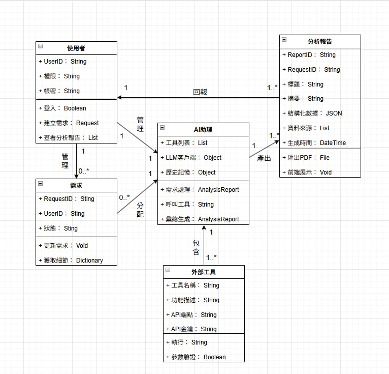
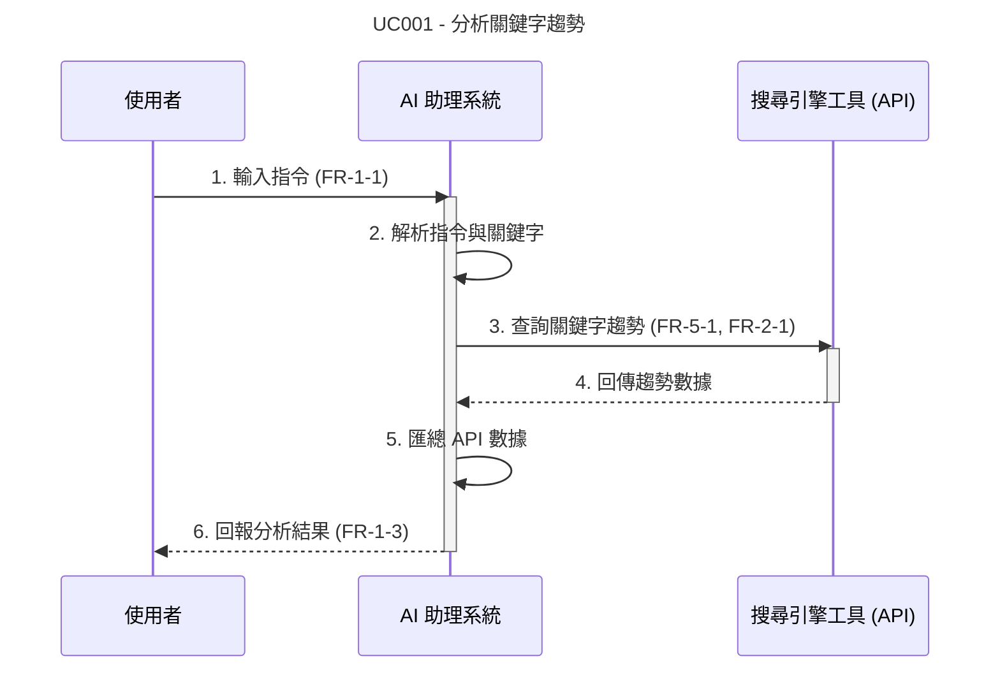
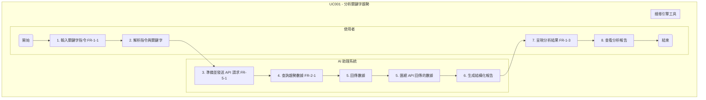
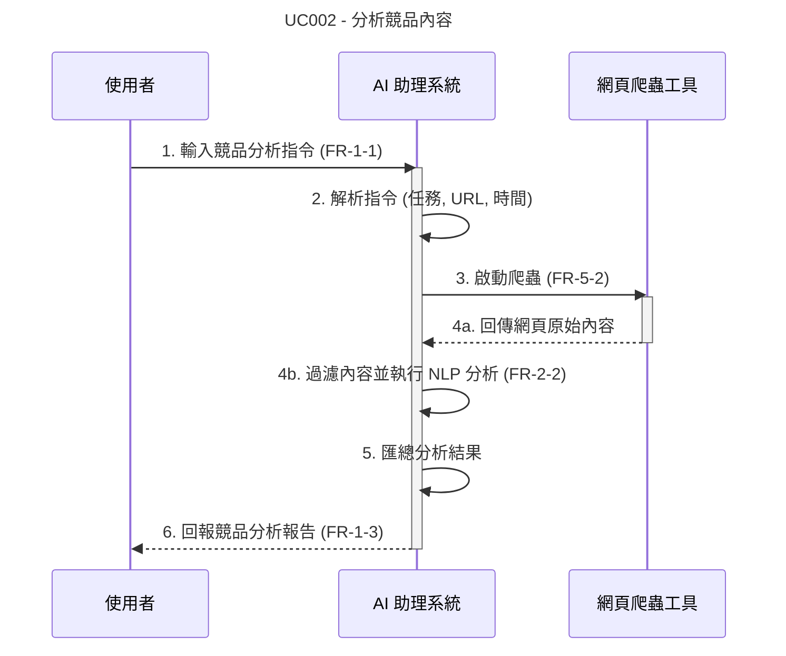
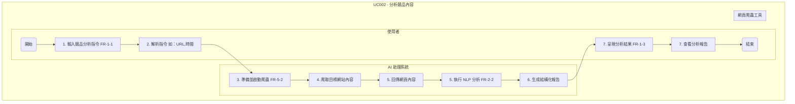
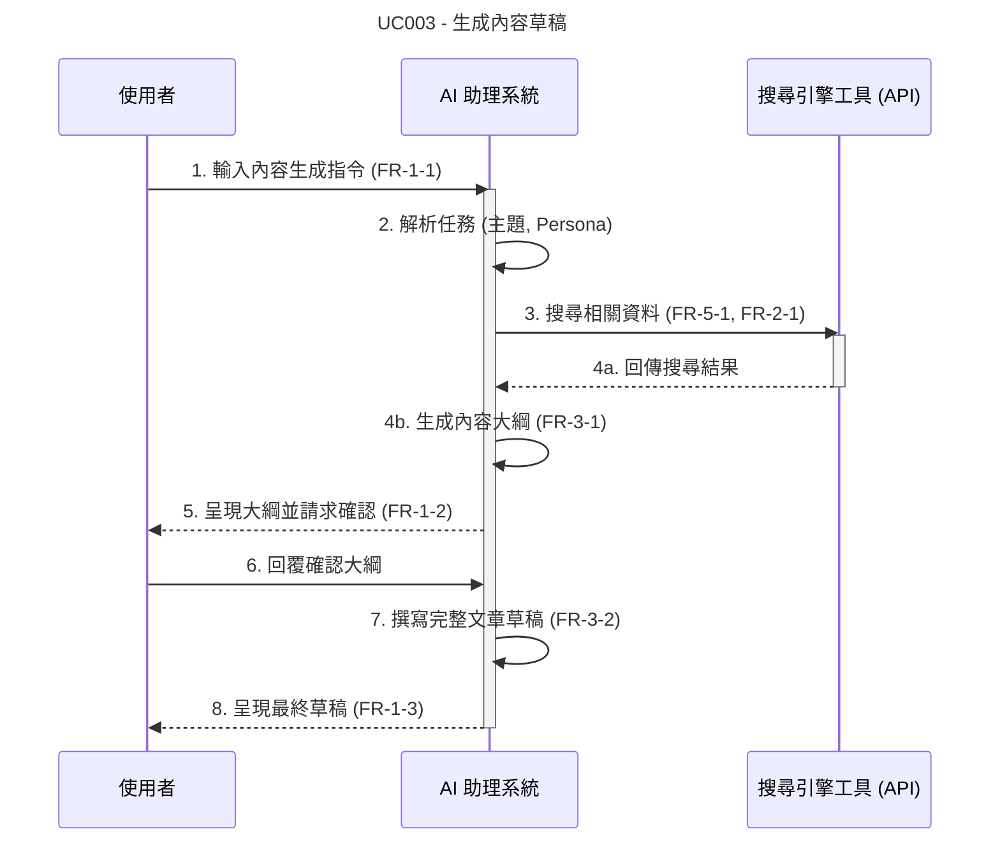
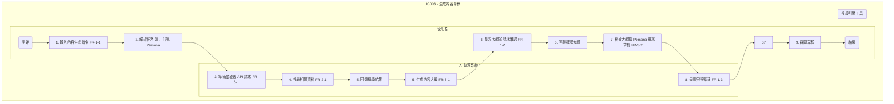

# Group HomeWork_5

## UML類別圖

----------------------------------
## 使用案例一：分析關鍵字趨勢(循序圖)

----------------------------------
## 使用案例一：分析關鍵字趨勢(活動圖)

----------------------------------
## 使用案例二：分析競品內容(循序圖)

----------------------------------
## 使用案例二：分析競品內容(活動圖)

----------------------------------
## 使用案例三：生成內容草稿(循序圖)

----------------------------------
## 使用案例三：生成內容草稿(活動圖)

----------------------------------
