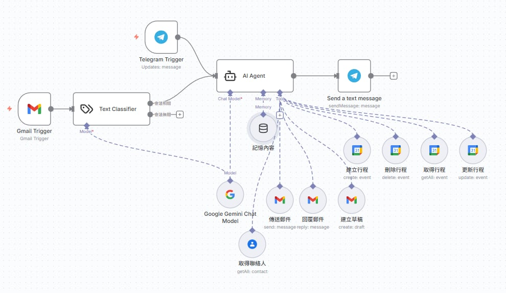
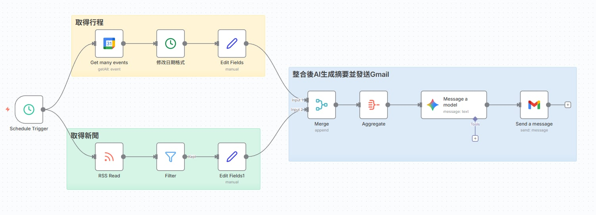
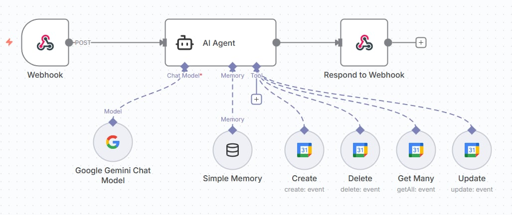
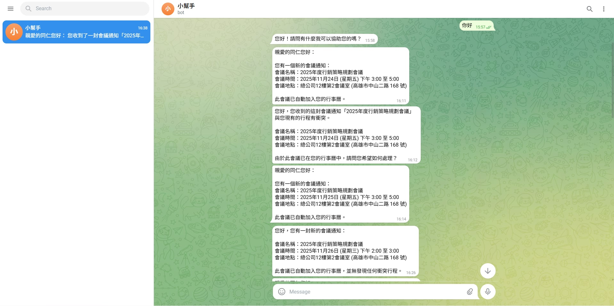
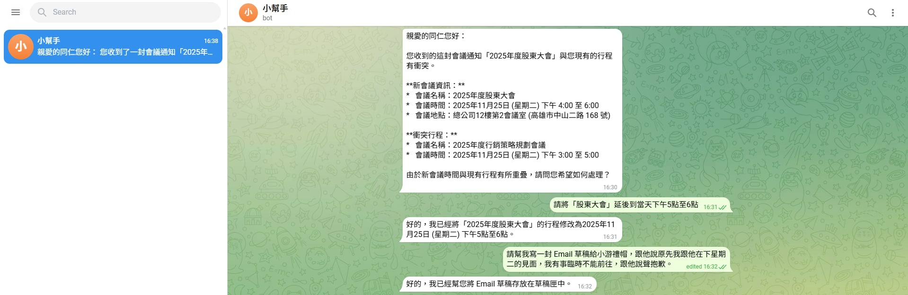
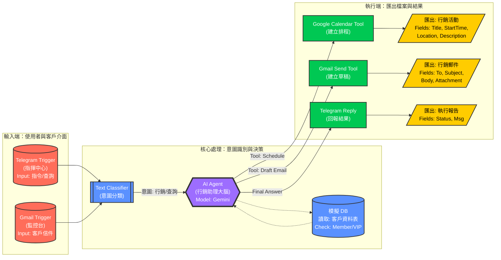

# Group HomeWork_6
# 初始套件設計

# 使用畫面

# 理想

# AI Agent 資料型態 & 驗證規則

定義 AI 行銷助理在處理輸入資料（來自 Telegram 指令或 Gmail 觸發）與後端系統互動時的資料規格。

## 1. 會員/客戶資料 (Member / Customer)
*用途：用於 n8n Gmail Node 發送行銷信件與 Google Contacts 聯絡人同步*

| 欄位名稱 (Field) | 資料型態 (Type) | 必填 | 驗證規則 (Validation Rules) | 說明 (Description) |
| :--- | :--- | :---: | :--- | :--- |
| `customer_id` | String (PK) | ✅ | Regex: `^C\d{5}$`   (例: C00123) | 系統唯一識別碼 |
| `name` | String | ✅ | Length: 2-50 chars | 客戶名稱或公司行號 |
| `email` | String | ✅ | Regex: `^[\w-\.]+@([\w-]+\.)+[\w-]{2,4}$` | **[關鍵]** 行銷信件發送目標 |
| `phone` | String | ❌ | Regex: `^09\d{8}$` | 手機號碼，用於簡訊通知 |
| `purchase_tier` | Enum | ✅ | [`General`, `VIP`, `Wholesale`] | 客戶分級，影響 AI 推薦策略 |

## 2. 行銷活動排程 (Marketing Campaign)
*用途：對應 n8n Google Calendar Tool 建立的活動物件*

| 欄位名稱 (Field) | 資料型態 (Type) | 必填 | 驗證規則 (Validation Rules) | 說明 (Description) |
| :--- | :--- | :---: | :--- | :--- |
| `campaign_title` | String | ✅ | Format: `[行銷] {Subject}` | 行事曆標題格式 |
| `start_datetime` | ISO8601 | ✅ | > `Current_Timestamp` | 活動開始時間 |
| `end_datetime` | ISO8601 | ✅ | > `start_datetime` | 活動結束時間 |
| `attendees` | List<String> | ❌ | Valid Email Format | 參與行銷會議的人員 Email |
| `description` | Text | ❌ | Max Length: 500 | AI 生成的活動摘要 |

---
