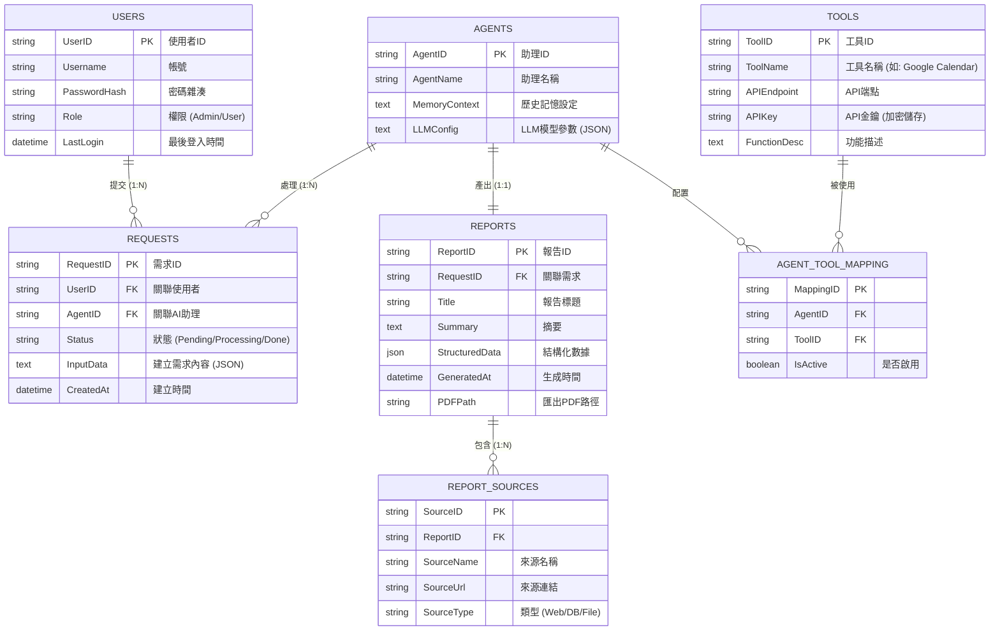

# Group HomeWork_7
## 實體關係圖

```mermaid
erDiagram
    %% 1. 使用者資料表
    USERS {
        string UserID PK "使用者ID"
        string Username "帳號"
        string PasswordHash "密碼雜湊"
        string Role "權限 (Admin/User)"
        datetime LastLogin "最後登入時間"
    }

    %% 2. 需求資料表 (連接使用者與AI)
    REQUESTS {
        string RequestID PK "需求ID"
        string UserID FK "關聯使用者"
        string AgentID FK "關聯AI助理"
        string Status "狀態 (Pending/Processing/Done)"
        text InputData "建立需求內容 (JSON)"
        datetime CreatedAt "建立時間"
    }

    %% 3. AI助理設定表
    AGENTS {
        string AgentID PK "助理ID"
        string AgentName "助理名稱"
        text MemoryContext "歷史記憶設定"
        text LLMConfig "LLM模型參數 (JSON)"
    }

    %% 4. 外部工具表
    TOOLS {
        string ToolID PK "工具ID"
        string ToolName "工具名稱 (如: Google Calendar)"
        string APIEndpoint "API端點"
        string APIKey "API金鑰 (加密儲存)"
        text FunctionDesc "功能描述"
    }

    %% 5. 分析報告表
    REPORTS {
        string ReportID PK "報告ID"
        string RequestID FK "關聯需求"
        string Title "報告標題"
        text Summary "摘要"
        json StructuredData "結構化數據"
        datetime GeneratedAt "生成時間"
        string PDFPath "匯出PDF路徑"
    }

    %% 6. [組合實體] 助理工具關聯表 (解決 AI與工具的 M:N 關係)
    AGENT_TOOL_MAPPING {
        string MappingID PK
        string AgentID FK
        string ToolID FK
        boolean IsActive "是否啟用"
    }

    %% 7. [組合實體] 報告來源明細表 (解決報告中 資料來源 List 的儲存)
    REPORT_SOURCES {
        string SourceID PK
        string ReportID FK
        string SourceName "來源名稱"
        string SourceUrl "來源連結"
        string SourceType "類型 (Web/DB/File)"
    }

    %% 關聯線定義
    USERS ||--o{ REQUESTS : "提交 (1:N)"
    AGENTS ||--o{ REQUESTS : "處理 (1:N)"
    AGENTS ||--|| REPORTS : "產出 (1:1)"
    
    AGENTS ||--o{ AGENT_TOOL_MAPPING : "配置"
    TOOLS ||--o{ AGENT_TOOL_MAPPING : "被使用"
    
    REPORTS ||--o{ REPORT_SOURCES : "包含 (1:N)"
```
