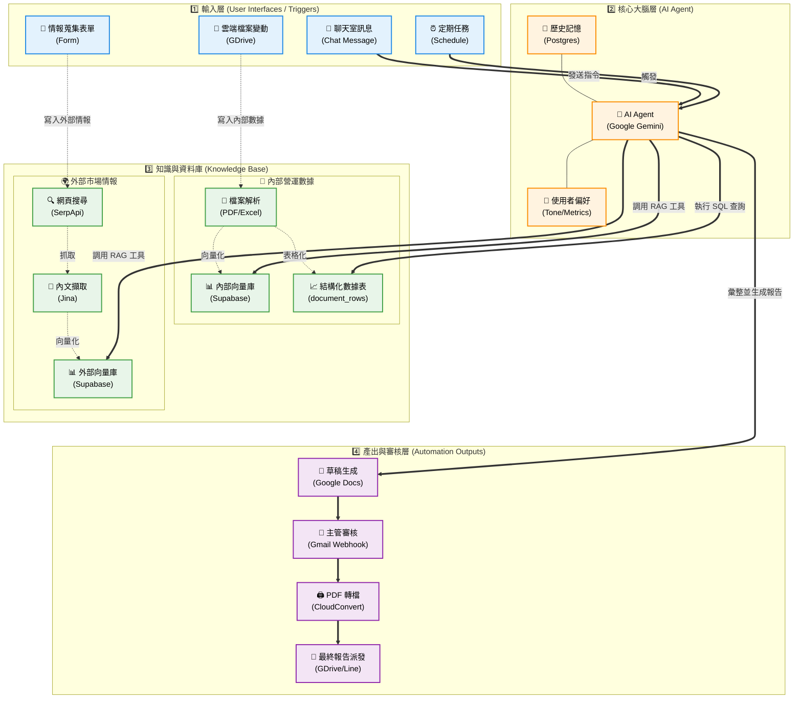

```mermaid
graph TD
    %% 定義層級專屬顏色 (提升書面報告的視覺專業度)
    classDef L1 fill:#e3f2fd,stroke:#1e88e5,stroke-width:2px,color:#000;
    classDef L2 fill:#fff3e0,stroke:#fb8c00,stroke-width:2px,color:#000;
    classDef L3 fill:#e8f5e9,stroke:#43a047,stroke-width:2px,color:#000;
    classDef L4 fill:#f3e5f5,stroke:#8e24aa,stroke-width:2px,color:#000;

    subgraph "1️⃣ 輸入層 (User Interfaces / Triggers)"
        ChatTrigger["💬 聊天室訊息<br>(Chat Message)"]:::L1
        FormTrigger["📝 情報蒐集表單<br>(Form)"]:::L1
        GDriveTrigger["📂 雲端檔案變動<br>(GDrive)"]:::L1
        ScheduleTrigger["⏰ 定期任務<br>(Schedule)"]:::L1
    end

    subgraph "2️⃣ 核心大腦層 (AI Agent)"
        Agent["🤖 AI Agent<br>(Google Gemini)"]:::L2
        Memory["💾 歷史記憶<br>(Postgres)"]:::L2
        UserPref["👤 使用者偏好<br>(Tone/Metrics)"]:::L2
        
        Memory --- Agent --- UserPref
    end

    subgraph "3️⃣ 知識與資料庫 (Knowledge Base)"
        subgraph Ext ["🌍 外部市場情報"]
            SerpApi["🔍 網頁搜尋<br>(SerpApi)"]:::L3
            JinaReader["📄 內文擷取<br>(Jina)"]:::L3
            ExtVector["📊 外部向量庫<br>(Supabase)"]:::L3
            SerpApi -.->|抓取| JinaReader -.->|向量化| ExtVector
        end
        
        subgraph Int ["🏢 內部營運數據"]
            ExtFromFile["📑 檔案解析<br>(PDF/Excel)"]:::L3
            IntVector["📊 內部向量庫<br>(Supabase)"]:::L3
            SQLData["📈 結構化數據表<br>(document_rows)"]:::L3
            ExtFromFile -.->|向量化| IntVector
            ExtFromFile -.->|表格化| SQLData
        end
    end

    subgraph "4️⃣ 產出與審核層 (Automation Outputs)"
        GDoc["📄 草稿生成<br>(Google Docs)"]:::L4
        Approval["📧 主管審核<br>(Gmail Webhook)"]:::L4
        PDFConv["🖨️ PDF 轉檔<br>(CloudConvert)"]:::L4
        FinalShare["🔗 最終報告派發<br>(GDrive/Line)"]:::L4
        
        GDoc ==> Approval ==> PDFConv ==> FinalShare
    end

    %% 🚨 魔法排版指令：隱藏定位線 (強制由上往下堆疊)
    ChatTrigger ~~~ Agent
    Agent ~~~ SerpApi
    ExtVector ~~~ GDoc
    SQLData ~~~ GDoc

    %% 跨層級實際資料流向
    ChatTrigger ==>|發送指令| Agent
    ScheduleTrigger ==>|觸發| Agent
    FormTrigger -.->|寫入外部情報| SerpApi
    GDriveTrigger -.->|寫入內部數據| ExtFromFile
    
    Agent ==>|調用 RAG 工具| ExtVector
    Agent ==>|調用 RAG 工具| IntVector
    Agent ==>|執行 SQL 查詢| SQLData
    
    Agent ==>|彙整並生成報告| GDoc
```

---
