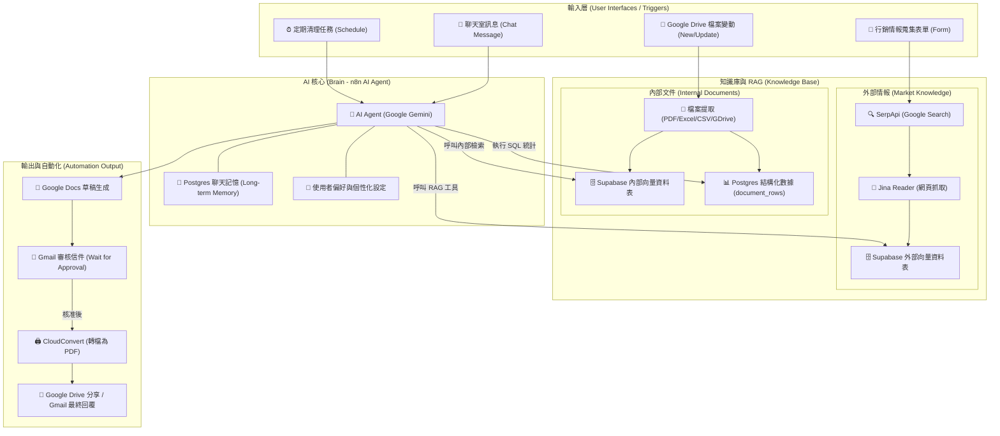

```mermaid
graph TD
    subgraph "輸入層 (User Interfaces / Triggers)"
        ChatTrigger["💬 聊天室訊息 (Chat Message)"]
        GDriveTrigger["📂 Google Drive 檔案變動 (New/Update)"]
        FormTrigger["📝 行銷情報蒐集表單 (Form)"]
        ScheduleTrigger["⏰ 定期清理任務 (Schedule)"]
    end

    subgraph "AI 核心 (Brain - n8n AI Agent)"
        Agent["🧠 AI Agent (Google Gemini)"]
        Memory["💾 Postgres 聊天記憶 (Long-term Memory)"]
        UserPref["👤 使用者偏好與個性化設定"]
        Agent --- Memory
        Agent --- UserPref
    end

    subgraph "知識庫與 RAG (Knowledge Base)"
        subgraph "外部情報 (Market Knowledge)"
            SerpApi["🔍 SerpApi (Google Search)"]
            JinaReader["📄 Jina Reader (網頁抓取)"]
            ExtVector["🗄️ Supabase 外部向量資料表"]
        end

        subgraph "內部文件 (Internal Documents)"
            ExtFromFile["📑 檔案提取 (PDF/Excel/CSV/GDrive)"]
            IntVector["🗄️ Supabase 內部向量資料表"]
            SQLData["📊 Postgres 結構化數據 (document_rows)"]
        end
    end

    subgraph "輸出與自動化 (Automation Output)"
        GDoc["📄 Google Docs 草稿生成"]
        Approval["📧 Gmail 審核信件 (Wait for Approval)"]
        PDFConv["🖨️ CloudConvert (轉檔為 PDF)"]
        FinalShare["🔗 Google Drive 分享 / Gmail 最終回覆"]
    end

    %% 連接關係
    ChatTrigger --> Agent
    GDriveTrigger --> ExtFromFile
    FormTrigger --> SerpApi
    
    SerpApi --> JinaReader --> ExtVector
    ExtFromFile --> IntVector
    ExtFromFile --> SQLData
    
    Agent -- "呼叫 RAG 工具" --> ExtVector
    Agent -- "呼叫內部檢索" --> IntVector
    Agent -- "執行 SQL 統計" --> SQLData
    
    Agent --> GDoc --> Approval
    Approval -- "核准後" --> PDFConv --> FinalShare
    ScheduleTrigger --> Agent
```

---
